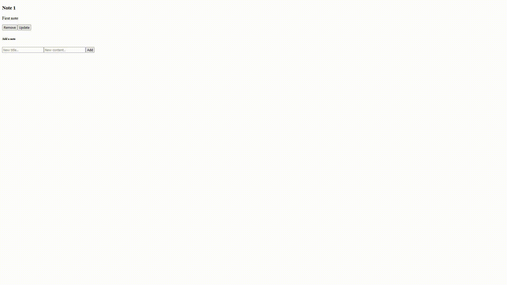

## Noteapp react - simple noting application created for self hosting written in react + typescript



## How to self host
1. Clone the repository
```bash
git clone https://github.com/Baguuc/noteapp-react
```
2. Install the dependencies
```bash
npm i
```
3. in directory src/config create file firebase.ts that exports app, database instances and "note" collection instance inside "collections" object. Example:
```typescript
// Import the functions you need from the SDKs you need
import { initializeApp } from "firebase/app";
import { collection, getFirestore } from "firebase/firestore";
// TODO: Add SDKs for Firebase products that you want to use
// https://firebase.google.com/docs/web/setup#available-libraries

// Your web app's Firebase configuration
// For Firebase JS SDK v7.20.0 and later, measurementId is optional
const firebaseConfig = {
    /* YOUR FIREBASE CONFIG */
};

// Initialize Firebase
const app = initializeApp(firebaseConfig);
const database = getFirestore(app);

// Initialize collections
const collections = {
    notes: collection(database, 'notes' /* this will be the collection you want to notes be stored in. Name it like you want. */),
}

// export needed variables
export { app, database, collections }
```
4. Start the application server
```bash
npm start
```

